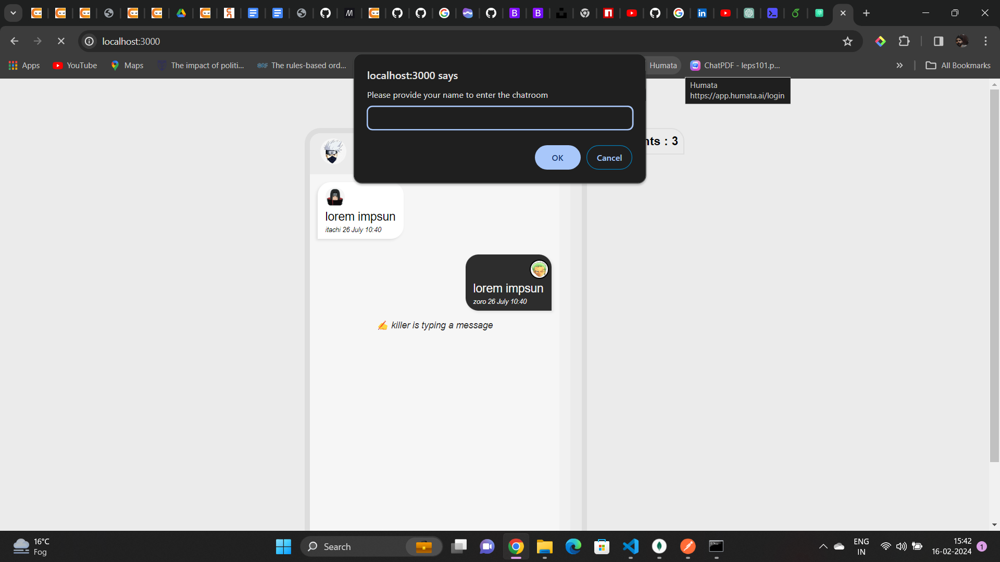
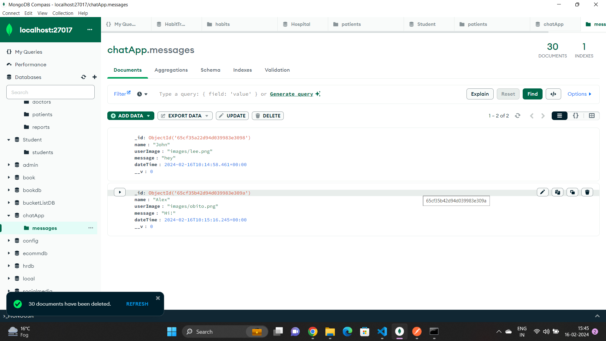

# ChatterUp - Real-Time Chat Application

ChatterUp is an interactive real-time chat application designed to facilitate seamless communication and interaction between users. Built using Node.js, Express.js, Socket.io, and MongoDB, it offers a robust and engaging chat experience.

## Features

### Socket-Based Architecture

ChatterUp utilizes WebSockets via the Socket.io library, enabling real-time, bidirectional communication between users.

### Code Modularity

The project follows modern development practices by employing ES6 Modules for code organization, ensuring maintainability and collaboration.

### User-Friendly Chat UI

The chat user interface is thoughtfully designed to enhance the user experience. It features components for seamless chatting and a notification panel displaying online users.

### User Onboarding

New users are prompted to provide their name upon joining ChatterUp for the first time. A warm welcome message is displayed in the header with their name.

### Chat History and User Count

Newly joined users have access to chat history and receive real-time information about the number of users currently online.

### Broadcasting Messages and Database Storage

Messages sent by users are broadcasted to all connected users in real-time and securely stored in the database for future reference.

### User Typing Indicators

A 'typing...' indicator is displayed to all connected users as users type messages, indicating which user is currently typing.

### Notification of New User Joins

When a new user joins, their name is added to the notification panel with an online symbol (green dot), and all connected users are notified.

### Notification of User Disconnections

When a user leaves the application, the notification panel is updated to reflect the remaining connected users.

### Profile Pictures for User Consistency

Each user has an associated profile picture displayed throughout the conversation, ensuring consistent visual identity.

### Displaying Chat Messages

Chat messages display the user's name, profile picture, message content, and timestamp for a comprehensive chat experience.

## Tasks

Follow these steps to build the ChatterUp project:

### Project Setup

- Set up an Express.js application and configure necessary settings.
- Initialize a MongoDB database (using MongoDB Atlas or similar service) to store chat messages and user data.

### Dependency Installation

- Install required project dependencies, including Node.js, Express.js, Socket.io, and Mongoose.

### User Interface Development

- Develop a user-friendly chat UI using HTML, CSS, and JavaScript or a modern front-end framework (e.g., React, Angular).
- Design and integrate components for chatting and a notification panel displaying online users.
- Ensure the UI is responsive and visually appealing.

### User Onboarding

- Implement a user onboarding process where new users provide their name and display a welcome message.
- Use front-end forms to collect user input and provide a smooth onboarding experience.

### Chat History and User Count

- Enable new users to access chat history, allowing them to catch up on previous conversations.
- Implement real-time updates for the count of users who have joined the chat.

### User Typing Indicators

- Utilize Socket.io to broadcast 'typing...' events to connected users.
- Implement front-end logic to display and remove typing indicators as users start and finish typing.

### Broadcasting Messages and Database Storage

- Implement real-time message broadcasting to all connected users.
- Ensure that messages are securely stored in the database for future retrieval.

### Notification of New User Joins

- Design the notification panel to update in real-time when a new user joins the chat.
- Use Socket.io to broadcast notifications of new user joins in real-time.

### Notification of User Disconnections

- Use Socket.io to broadcast user disconnection events in real-time.

### Profile Pictures

- Store default profile pictures and consistently display them for each user.

### Displaying Chat Messages

- Create templates for chat message display, including the user's name, profile picture, message content, and timestamp.
- Use front-end components to render messages for all connected users.

## API Structure

The API structure for ChatterUp includes routes for rendering the UI, managing user authentication, handling chat messages, and more.

##Screenshots

